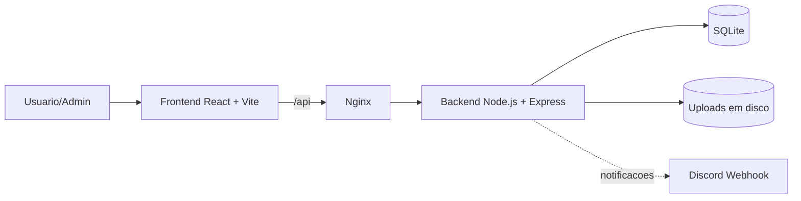

# Arquitetura do iAfiliado v2

Este documento descreve a arquitetura atual do projeto com base no código-fonte do repositório.

> Fonte de verdade: implementação em `src/` e `backend/`.  
> Observação: o backend atual utiliza **SQLite** (`better-sqlite3`), não PostgreSQL.

## 1) Visão geral

O sistema é uma aplicação web fullstack para gestão de afiliados, com:

- autenticação e autorização (usuário, admin e manager);
- dashboard de métricas e carteira;
- administração de cassinos, entradas, contratos, saques e usuários;
- suporte com tickets e anexos;
- notificações opcionais via Discord.

Arquitetura macro:



## 2) Componentes principais

### 2.1 Frontend (`src/`)

- **Stack**: React 18, TypeScript, Vite, React Router, Tailwind, shadcn/ui.
- **Entrada**: `src/main.tsx`.
- **Roteamento principal**: `src/App.tsx`.
- **Cliente HTTP**: `src/lib/api-client.ts`.
  - Base URL padrão: `/api`.
  - Em dev, Vite faz proxy para `http://localhost:3000`.
  - Autenticação via cookie HttpOnly: `credentials: 'include'` (não envia Bearer no header).
- **Auth client-side**:
  - `src/lib/auth.ts`: apenas **dados não sensíveis** em `localStorage` (tipo `StoredUser`: id, username, is_admin, is_support, is_manager, role); token em cookie HttpOnly (não acessível por JS); dados sensíveis (email, telefone, nome) obtidos via API (`GET /profile`) quando necessário;
  - `src/lib/api-client.ts` (`credentials: 'include'` para enviar o cookie);
  - `src/components/ProtectedRoute.tsx` (proteção de rota e guard de admin).
- **Módulos de tela**:
  - dashboard de afiliado;
  - painel administrativo;
  - suporte cliente/admin;
  - fluxo de login/registro.

### 2.2 Backend (`backend/`)

- **Stack**: Node.js, Express 5, `better-sqlite3`, `jsonwebtoken`, `bcrypt`, `multer`, `helmet`, `express-rate-limit`, `express-validator`.
- **Entrada da API**: `backend/server.js`.
- **Definição de rotas e validações**: `backend/routes.js`.
- **Banco e bootstrap de schema**: `backend/db.js` + `backend/schema.sql`.
- **Arquitetura em camadas**:
  - **Controllers**: orquestração HTTP.
  - **Services**: regras de negócio.
  - **Repositories**: SQL/acesso a dados.
- **Cross-cutting**:
  - `middleware/errorHandler.js` (tratamento central de erros),
  - `utils/logger.js`,
  - `auth/authMiddleware.js` e `auth/adminAuthMiddleware.js`,
  - `config/env.js` e `config/constants.js`.

### 2.3 Testes

- **Frontend** (Vitest): `src/lib/auth.test.ts`, `src/lib/api-client.test.ts`, `src/pages/Admin/utils.solicitacoes-filter.test.ts`, `src/test/example.test.ts`. Comando: `npm test -- --run` (raiz do projeto). Cobrem auth (cookie HttpOnly, StoredUser em localStorage sem dados sensíveis), api-client (credentials, erros) e utilitários do admin.
- **Backend** (Node.js `node --test`): `backend/tests/integration/*.test.js`, `backend/tests/flows/*.test.js`, `backend/tests/infrastructure/*.test.js`. Comando: `npm test` (em `backend/`). Cobrem API (registro, login, logout, cookie, suporte, contratos, saques, admin), fluxos de negócio e infra (error handler, CORS, env).
- **Execução:** frontend e backend devem rodar com sucesso para validar o estado atual da arquitetura (ex.: 23 testes frontend, 44 testes backend).

### 2.4 Infra de execução

- **Local/dev**:
  - frontend via Vite;
  - backend Express em `:3000`.
- **Produção**:
  - frontend em Nginx;
  - backend em container dedicado;
  - volumes para banco (`/app/data`) e uploads (`/app/uploads`);
  - `docker-compose.yml` / `docker-compose.build.yml`.

## 3) Responsabilidades por camada

### 3.1 Camada de apresentação (Frontend)

Responsável por:

- renderizar UI e navegação;
- coletar input do usuário;
- chamar API;
- exibir feedback, loading e erro.

Não deve conter:

- regras de autorização de servidor;
- lógica de integridade de dados crítica.

### 3.2 Camada de entrada HTTP (routes + controllers)

Responsável por:

- mapear endpoints;
- aplicar validação/sanitização;
- acionar autenticação/autorização;
- converter resultado de serviço em resposta HTTP.

### 3.3 Camada de domínio (services)

Responsável por:

- regras de negócio;
- verificações semânticas (ex.: saldo para saque, limite de solicitações);
- coordenação de múltiplos repositories;
- acionamento de integrações externas (Discord).

### 3.4 Camada de persistência (repositories)

Responsável por:

- SQL e transações;
- mapeamento entre tabelas e objetos de domínio;
- isolamento de detalhes de banco.

### 3.5 Camada de infraestrutura e segurança

Responsável por:

- inicialização do servidor;
- políticas de CORS, headers e rate-limit;
- parser de body/upload;
- log estruturado;
- tratamento central de erros;
- validação de variáveis de ambiente.

## 4) Módulos de negócio (backend)

### 4.1 Auth

- **Entradas**: `/register`, `/login`, `/logout`, `/profile`.
- **Funções**:
  - hash de senha (`bcrypt`);
  - emissão de JWT com expiração (`1d`);
  - **token em cookie HttpOnly** (`auth_token`): `Set-Cookie` com `HttpOnly`, `Secure` (produção), `SameSite=Strict`; proteção contra XSS (JS não acessa o token);
  - bloqueio de usuários (`is_blocked`) no middleware;
  - `POST /logout` limpa o cookie de autenticação.
- **Proteção contra força bruta**:
  - **Rate limiting**: 5 tentativas de login por 15 minutos por IP (`RATE_LIMIT.AUTH`).
  - **CAPTCHA**: após 3 tentativas falhas por IP, o próximo login exige `captchaToken` (reCAPTCHA v2); em teste o CAPTCHA é dispensado.
  - **Bloqueio temporário de conta**: após 5 tentativas falhas para o mesmo usuário, a conta fica bloqueada por 15 minutos (`locked_until`); o usuário recebe 403 com mensagem de tempo restante.
  - **Notificação por email**: ao bloquear a conta, o backend envia email ao usuário (via SendGrid se `SENDGRID_API_KEY` estiver definida) avisando das tentativas suspeitas.

### 4.2 Dashboard

- **Entradas**: `/me/stats`, `/me/wallet`, `/me/casas`, `/me/entradas`, `/me/managed-accounts`.
- **Funções**:
  - agregações por usuário;
  - leitura de carteira e vínculos com cassinos;
  - filtros por intervalo/casa.

### 4.3 Admin

- **Entradas**: `/admin/*`.
- **Funções**:
  - CRUD de cassinos;
  - gestão de entradas e recomputação de carteira;
  - gestão de status cadastral;
  - gestão de usuários (bloqueio/remoção);
  - auditoria (`admin_logs`);
  - gestão de contas atribuídas a managers.

### 4.4 Support

- **Entradas**:
  - público: `/support`;
  - autenticado: `/support/ticket`, `/support/ticket/:id/reply`, `/support/my-messages`;
  - admin: `/support/messages`, `PUT /support/messages/:id`.
- **Funções**:
  - abertura de ticket;
  - respostas e anexos;
  - autorização de acesso por ticket;
  - notificação opcional no Discord.

### 4.5 Contracts

- **Entradas**: `/me/contracts`, `/admin/contracts`, `/admin/contracts/:id/status`.
- **Funções**:
  - solicitação de vínculo com casa;
  - limitação de pendências;
  - aprovação/rejeição admin;
  - criação de vínculo em `affiliate_casinos`.

### 4.6 Withdrawals

- **Entradas**: `/me/withdrawals`, `/admin/withdrawals`, `/admin/withdrawals/:id/status`.
- **Funções**:
  - criação de solicitação de saque;
  - validação de saldo mínimo/disponível;
  - processamento admin com atualização de carteira.

## 5) Modelo de dados (alto nível)

Tabelas centrais:

- `users` (inclui `failed_login_attempts`, `locked_until` para bloqueio temporário após falhas de login)
- `casinos`
- `affiliate_casinos`
- `entradas`
- `wallet_totals`
- `contracts`
- `support_messages`
- `support_replies`
- `support_attachments`
- `withdrawal_requests`
- `admin_logs`
- `manager_managed_accounts`

Características relevantes:

- foreign keys habilitadas;
- índices para consultas frequentes;
- triggers de atualização de `updated_at`;
- modo WAL para melhorar concorrência de leitura/escrita no SQLite.

## 6) Fluxos de dados principais

### 6.1 Login

1. Frontend envia credenciais para `/login`.
2. Backend valida input, busca usuário e compara hash.
3. Backend retorna JWT (enviado em cookie HttpOnly) + dados do usuário.
4. Frontend persiste apenas **StoredUser** (id, username, roles) em `localStorage`; token fica no cookie. Perfil completo (nome, email, telefone) é obtido via `GET /profile` quando a tela precisar (ex.: dashboard, suporte).

### 6.2 Dashboard do afiliado

1. Frontend chama `/profile`, `/me/casas`, `/me/stats`, `/me/entradas`.
2. Backend aplica auth e filtros por `req.user.id`.
3. Repositories agregam e retornam dados normalizados.
4. Frontend renderiza cards, gráficos e listas.

### 6.3 Abertura e resposta de ticket

1. Frontend envia `multipart/form-data` (com anexos opcionais).
2. Multer valida tamanho/tipo e salva em disco.
3. Ticket/resposta é persistido em SQLite.
4. Se configurado, backend dispara notificação ao Discord.

### 6.4 Aprovação de saque

1. Usuário cria solicitação (`pendente`).
2. Admin aprova/rejeita.
3. Em aprovação, backend debita `saldo_disponivel` e soma `valor_total_sacado`.
4. Registro final fica em `withdrawal_requests`.

## 7) Segurança e governança

Controles implementados:

- JWT assinado por segredo de ambiente; token enviado via **cookie HttpOnly** (Secure em produção, SameSite=Strict);
- **Dados no cliente**: em `localStorage` só são persistidos dados não sensíveis (`StoredUser`: id, username, roles); email, telefone, nome completo e outros PII vêm da API (`GET /profile`) quando necessário, reduzindo risco de vazamento por XSS e alinhando à minimização de dados (LGPD);
- bcrypt para senha;
- validação/sanitização com `express-validator`;
- **rate-limit de auth**: 5 tentativas por 15 min por IP; CAPTCHA (reCAPTCHA v2) após 3 falhas por IP; bloqueio temporário de conta (15 min) após 5 falhas; notificação por email ao bloquear (SendGrid opcional);
- rate-limit global e por domínio sensível (auth/suporte);
- helmet (CSP em produção);
- **X-XSS-Protection**: header `1; mode=block` no backend (Express) e no Nginx para respostas do front;
- **Nginx**: `server_tokens off` para não expor a versão do servidor no header `Server`;
- CORS com whitelist em produção;
- tratamento de erro padronizado sem vazamento de stack em produção;
- logs com `requestId`;
- upload com validação de MIME/extensão/limites.

### 7.1 Armazenamento de senhas

Fluxo e responsabilidades:

| Etapa                   | Onde                                     | Detalhe                                                                                                                                  |
| ----------------------- | ---------------------------------------- | ---------------------------------------------------------------------------------------------------------------------------------------- |
| **Persistência**        | `backend/schema.sql`                     | Coluna `users.password_hash` (TEXT NOT NULL). Apenas o hash é armazenado; a senha em texto claro nunca é gravada.                        |
| **Constantes**          | `backend/config/constants.js`            | `AUTH.SALT_ROUNDS: 10`, `AUTH.MIN_PASSWORD_LENGTH: 8`.                                                                                   |
| **Hash no registro**    | `backend/services/authService.js`        | `bcrypt.hash(payload.password, AUTH.SALT_ROUNDS)` antes de inserir; validação de complexidade (pelo menos uma letra e um número).        |
| **Comparação no login** | `backend/services/authService.js`        | `bcrypt.compare(password, user.password_hash)`; em caso de sucesso, `delete user.password_hash` antes de devolver o usuário na resposta. |
| **Repositório**         | `backend/repositories/authRepository.js` | `findByIdentifier` inclui `password_hash` apenas para login; `findPublicById` e listagens **não** retornam `password_hash`.              |
| **Validação HTTP**      | `backend/routes.js`                      | `express-validator`: senha obrigatória e mínimo de caracteres em `/login` e `/register`.                                                 |

Resumo: senhas são hasheadas com **bcrypt** (10 salt rounds), armazenadas somente como hash na tabela `users`, nunca retornadas pela API e removidas do objeto usuário antes de qualquer resposta. Não há fluxo de redefinição de senha (esqueci senha) implementado no backend; a tela correspondente existe apenas no frontend.

Pontos de atenção:

- rota `/uploads` é pública (acesso por nome do arquivo);
- políticas de retenção/rotação de uploads e logs devem ser definidas operacionalmente.

## 8) Dependências externas

### 8.1 Runtime e bibliotecas

- Node.js 20+
- Docker / Docker Compose
- Nginx
- Pacotes backend e frontend listados em `package.json`.

### 8.2 Serviços externos

- **Discord Webhook** (opcional): notificações de suporte.
- **GitHub Actions + Docker Hub + SSH**: pipeline de build/deploy.

## 9) Disponibilidade e resiliência

### 9.1 Características atuais

- healthcheck HTTP (`/health`);
- reinício automático de containers (`restart: unless-stopped`);
- volumes persistentes para dados e uploads;
- graceful shutdown no backend.

### 9.2 Pontos críticos para disponibilidade

1. **Banco SQLite como single point of failure**  
   Falha de disco/volume afeta toda a aplicação.

2. **Escalabilidade horizontal limitada do SQLite**  
   É excelente para footprint baixo, mas pode virar gargalo sob alta escrita concorrente.

3. **Dependência de disco para uploads**  
   Crescimento sem controle pode impactar disponibilidade.

4. **Polling frequente em algumas telas**  
   Pode elevar carga em picos de usuários.

5. **Dependência de variáveis obrigatórias**  
   Configuração incorreta impede startup (ex.: `JWT_SECRET`, `CORS_ORIGINS` em produção).

6. **Deploy acoplado a infraestrutura única**  
   Sem estratégia nativa de failover multi-nó.

## 10) Estratégia recomendada de evolução arquitetural

Curto prazo:

- definir política de backup/restore de SQLite;
- instrumentar métricas (latência por endpoint, taxa de erro, saturação de CPU/memória, tamanho de DB/uploads);
- reduzir polling com backoff e atualização incremental.

Médio prazo:

- mover uploads para armazenamento objeto (S3 compatível);
- introduzir fila para tarefas não críticas (notificações, jobs);
- considerar cache para endpoints agregados de dashboard/admin.

Longo prazo (se carga crescer):

- migrar persistência principal para banco cliente-servidor (PostgreSQL);
- separar serviços por domínio (auth/admin/support/analytics) gradualmente;
- adotar estratégia de alta disponibilidade com réplicas e failover.

## 11) Estrutura resumida de diretórios

```text
iAfiliado-v2/
├── src/                       # Frontend React
│   ├── components/
│   ├── hooks/
│   ├── lib/
│   ├── pages/
│   └── types/
├── backend/                   # API Express
│   ├── auth/
│   ├── config/
│   ├── controllers/
│   ├── services/
│   ├── repositories/
│   ├── middleware/
│   ├── utils/
│   ├── errors/
│   ├── tests/
│   ├── db.js
│   ├── routes.js
│   ├── server.js
│   └── schema.sql
├── docs/
├── Dockerfile                 # Frontend (build + nginx)
├── docker-compose.yml
└── docker-compose.build.yml
```

## 12) Referências

- Endpoints: `docs/API.md`
- Banco de dados: `docs/DATABASE.md`
- Segurança backend: `docs/SECURITY-BACKEND.md`
- Setup e execução: `README.md`
- Testes: na raiz `npm test -- --run` (frontend); em `backend/` executar `npm test` (backend).
