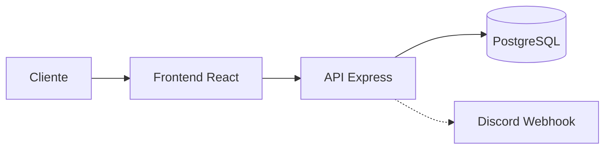

# Arquitetura — Afiliado Trabalho

Visão geral da arquitetura do projeto: frontend, backend, fluxos principais e módulos.

## Visão geral

A aplicação é dividida em:

- **Frontend**: React + TypeScript + Vite, rodando em `http://localhost:5173` em desenvolvimento. Comunica com a API via HTTP (JSON) e envia o token JWT no header `Authorization: Bearer <token>` nas rotas protegidas.
- **Backend**: Express (Node.js), rodando em `http://localhost:3000`. Serve a API REST, faz autenticação JWT, persiste dados no PostgreSQL e, opcionalmente, envia notificações para o Discord via webhook.

## Fluxos principais

### Autenticação

1. **Registro** (`POST /register`): o cliente envia nome, login, email e senha. O backend valida, verifica se email/login já existem, faz hash da senha com bcrypt, insere em `clients` e retorna um JWT (payload: id, email, is_admin; expira em 1 dia).
2. **Login** (`POST /login`): o cliente envia email ou login e senha. O backend busca o usuário, compara a senha com bcrypt e retorna um JWT.
3. **Rotas protegidas**: o `authMiddleware` lê o header `Authorization: Bearer <token>`, verifica o JWT com `JWT_SECRET` e popula `req.user`. Se o token estiver ausente ou inválido, responde 401.
4. **Rotas de admin**: além do `authMiddleware`, o `adminAuthMiddleware` exige `req.user.is_admin === true`. Caso contrário, responde 403.

### Suporte (tickets)

1. **Ticket público** (`POST /support`): qualquer pessoa envia nome, email, assunto e mensagem (multipart/form-data). Pode incluir anexos (até 5 MB cada). O backend grava em `support_messages` e, se configurado, envia notificação ao Discord. Não exige login.
2. **Ticket logado** (`POST /support/ticket`): igual ao público, mas o usuário está autenticado. O `user_id` é salvo no ticket e o tipo de cliente (VIP, gestor, influencer) pode definir prioridade alta automaticamente.
3. **Respostas** (`POST /support/ticket/:id/reply`): usuário ou suporte adiciona resposta; gravada em `support_replies`. Anexos são permitidos. Notificação Discord opcional.
4. **Listagem**: usuário vê seus tickets em `GET /support/my-messages`; admin vê todos em `GET /support/messages`. Atualização de status/prioridade (admin): `PUT /support/messages/:id`.

## Principais módulos do backend

| Módulo                        | Responsabilidade                                                                                                                                                                |
| ----------------------------- | ------------------------------------------------------------------------------------------------------------------------------------------------------------------------------- |
| `server.js`                   | Ponto de entrada: cria o app Express, configura CORS, `express.json()`, monta a pasta de uploads em `/uploads` e as rotas, inicia o servidor na porta 3000.                     |
| `routes.js`                   | Define todas as rotas da API e a configuração do Multer (destino e limite de 5 MB). Agrupa rotas públicas, autenticadas e de admin.                                             |
| `db.js`                       | Cria o pool PostgreSQL a partir de variáveis de ambiente (`DB_HOST`, `DB_PORT`, `DB_NAME`, `DB_USER`, `DB_PASSWORD`) e testa a conexão.                                         |
| `auth/register.js`            | Registro de cliente: validação, verificação de email/login duplicado, hash bcrypt, INSERT em `clients`, geração do JWT.                                                         |
| `auth/login.js`               | Login: busca por email ou login, compara senha com bcrypt, geração do JWT. Também exporta `getProfile` e `getClients`.                                                          |
| `auth/authMiddleware.js`      | Middleware que exige header `Authorization: Bearer <token>`, verifica o JWT e define `req.user`.                                                                                |
| `auth/adminAuthMiddleware.js` | Middleware que exige `req.user.is_admin` (deve ser usado após `authMiddleware`).                                                                                                |
| `support/message.js`          | Lógica de tickets: criação (público e logado), listagem, atualização de status/prioridade, respostas e associação de anexos. Usa `pool` e chama `discord.js` para notificações. |
| `discord.js`                  | Envio de notificações ao Discord via webhook (`DISCORD_WEBHOOK_URL`): novo ticket e novas respostas, com prioridade e anexos quando aplicável.                                  |

## Frontend (resumo)

- **App.tsx**: configura os providers (QueryClient, Tooltip, Toaster, Sonner) e o React Router com todas as rotas (Index, Login, Register, Dashboard, Suporte, etc.). Rota catch-all `*` para 404.
- **Páginas**: cada rota renderiza uma página em `src/pages/` (ex.: Login, Register, Dashboard, SuporteCliente, SuporteAdmin). As chamadas à API usam a base `http://localhost:3000` e armazenam o token no `localStorage` após login.
- **Componentes**: UI em `src/components/` (incluindo shadcn/ui em `components/ui/`).

Para mais detalhes dos endpoints, ver [API.md](API.md). Para o schema do banco, ver [DATABASE.md](DATABASE.md).
